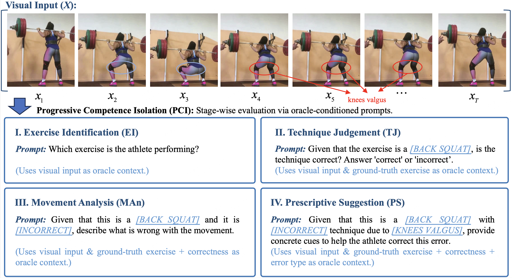

# FitAug-1.2M

FitAug-1.2M is a large-scale image-text augmentation dataset for vision-language-model (VLM) based fitness guidance.

## Overview

FitAug-1.2M is introduced to support more reliable and fine-grained VLM-based fitness coaching. Our goal is not only to build a larger fitness dataset, but to enrich the supervision modality with high-quality, professionally grounded textual guidance for movement assessment and coaching.

In particular, we target a practical gap in current VLM fitness guidance systems: many models can generate fluent feedback, but they still lack sufficiently reliable, expert-level supervision for correctness-sensitive movement understanding and actionable coaching.

## Why FitAug-1.2M

We build FitAug-1.2M to provide large-scale, high-quality image-text supervision for fitness guidance, with a particular focus on professional movement instruction.

Rather than collecting generic action descriptions, we construct expert-oriented guidance annotations that describe whether a movement is correct, why it is incorrect, and how it should be corrected. This makes the dataset suitable for training and analyzing VLMs for practical fitness coaching rather than generic action recognition alone.

## Data Sources

FitAug-1.2M is built from publicly available visual resources for fitness and action understanding. The source pool includes fitness-related datasets and publicly accessible online video materials covering home, commercial gym, and outdoor workout scenarios.

To improve diversity and practical relevance, we intentionally collect visual material with variation in viewpoint, environment, user appearance, and exercise execution. While the visual content is drawn from public resources, all task-oriented guidance annotations in FitAug-1.2M are newly created under our unified annotation protocol.

## Annotation Pipeline

FitAug-1.2M is annotated through a multi-stage expert-guided pipeline designed to ensure both professional quality and large-scale coverage.

First, certified coaches annotate the visual data based on domain-specific instructional knowledge and professional exercise standards described in our paper. The annotations focus on exercise correctness, error identification, rationale analysis, and corrective feedback.

Second, the annotated samples are reviewed by another expert to ensure consistency, correctness, and instructional value. Only samples that pass expert review are retained as seed supervision.

Third, based on the validated expert annotations, we use large language models to expand the textual supervision in a controlled way. This expansion is guided by expert-designed templates and structured metadata so that the generated text remains semantically diverse while preserving professional correctness.

This pipeline allows us to combine expert reliability with scalable text augmentation.

## Dataset Scale

The final dataset contains large-scale image-text supervision for apparatus-centric fitness guidance, including expert-validated annotations and expanded textual guidance.

FitAug-1.2M includes:

- 9,611 curated image sequences
- 263 expert-authored question templates
- 531 expert-authored answer templates
- 1,208,340 human-vetted image-text QA pairs

The dataset focuses on four representative apparatus-centric exercises:

- Barbell Row
- Bench Press
- Back Squat
- Overhead Press

It covers 14 scenario types and 34 fine-grained error types.

## Benchmark and Evaluation

Beyond dataset construction, our broader study also examines how well current VLMs perform on fitness guidance.

We evaluate VLMs under a fine-grained benchmark setting rather than relying on coarse or single-dimensional scoring. This benchmark is designed to measure whether a model can provide useful, reliable, and instructionally meaningful fitness guidance across multiple coaching abilities.

## 5D Evaluation Dimensions

To evaluate VLM-based fitness guidance more comprehensively, we introduce a 5-dimensional subjective evaluation framework covering:

- **Motivational Encouragement (ME)**  
  Whether the model provides supportive and motivating coaching language

- **Program Design (PD)**  
  Whether the model gives reasonable and structured training advice

- **Macronutrient Allocation (MA)**  
  Whether the model provides appropriate nutrition-related guidance

- **Equipment Recognition (ER)**  
  Whether the model correctly understands the exercise equipment and context

- **Movement Assessment (MAs)**  
  Whether the model correctly judges movement quality and provides useful corrective guidance

This 5D framework is designed to capture coaching competence more comprehensively than movement-only evaluation.

## PCI for Movement Assessment

Movement assessment remains the most correctness-sensitive part of fitness guidance. To better diagnose model performance in this dimension, we further introduce **Progressive Competence Isolation (PCI)**.

PCI decomposes movement assessment into four sequential stages:

- **Exercise Identification (EI)**
- **Technique Judgment (TJ)**
- **Movement Analysis (MAn)**
- **Prescriptive Suggestion (PS)**

This stage-wise protocol allows us to analyze where a model succeeds or fails within the movement-assessment pipeline, rather than treating the whole task as a single black-box score.

In our benchmark analysis, we find that many models can produce plausible explanations or suggestions, yet remain much weaker at correctness-sensitive technique judgment. In practice, this means a model may sound helpful before it can reliably judge whether a movement is actually correct.

FitAug-1.2M is built to address exactly this gap.

## Benchmark Leaderboard

Using the 5D framework and PCI-based movement analysis, we build the FitGuid benchmark and evaluate a broad range of open-source and closed-source VLMs.

The leaderboard is included in this repository to provide a practical reference for model selection. It helps users compare models not only by overall performance, but also by their strengths and weaknesses across different coaching dimensions and movement-assessment stages.

Across the benchmark, **MAs is consistently much lower than the other 5D dimensions**, and PCI further shows that **weak Technique Judgment (TJ)** is the dominant bottleneck for reliable VLM-based fitness guidance.

### Full Leaderboard

| Model | ME | PD | MA | ER | MAs | EI | TJ | MAn | PS | Avg |
|---|---:|---:|---:|---:|---:|---:|---:|---:|---:|---:|
| Grok-4 | 100.00 | 61.77 | 79.17 | 93.79 | 31.72 | 92.00 | 56.43 | 72.14 | 84.69 | 73.29 |
| GLM-4.5V | 93.87 | 63.96 | 77.90 | 89.66 | 27.90 | 86.00 | 48.57 | 67.86 | 98.44 | 70.66 |
| GPT-5 | 92.45 | 45.73 | 75.96 | 94.83 | 42.52 | 97.00 | 53.57 | 82.86 | 98.75 | 70.30 |
| Qwen3-VL-235B-A22B | 97.17 | 56.04 | 70.51 | 84.14 | 21.30 | 90.00 | 46.43 | 62.50 | 81.56 | 65.83 |
| Claude-Sonnet-4.5 | 85.85 | 54.06 | 66.35 | 91.03 | 25.79 | 80.00 | 50.71 | 72.14 | 88.12 | 64.62 |
| Gemini-2.5-Pro | 100.00 | 61.25 | 77.90 | 50.00 | 32.04 | 97.00 | 59.29 | 77.86 | 71.56 | 64.24 |
| Qwen3-VL-30B | 91.51 | 42.71 | 72.12 | 90.34 | 15.81 | 88.00 | 52.86 | 57.86 | 58.75 | 62.50 |
| Qwen3-VL-4B | 91.51 | 39.79 | 70.19 | 88.62 | 17.12 | 92.00 | 47.14 | 47.50 | 83.12 | 61.45 |
| GLM-4.1V-9B | 78.30 | 45.21 | 64.74 | 85.17 | 23.65 | 91.00 | 50.71 | 59.64 | 85.94 | 59.42 |
| QwenVL2.5-32B | 85.85 | 39.17 | 67.95 | 78.62 | 20.43 | 83.00 | 52.86 | 55.00 | 84.69 | 58.40 |
| ERNIE-4.5-VL-424B-A47B | 80.65 | 45.73 | 50.96 | 87.93 | 20.95 | 90.00 | 51.43 | 55.71 | 81.25 | 57.25 |
| Gemma3-27B | 72.64 | 38.85 | 66.03 | 86.21 | 20.87 | 88.00 | 50.00 | 57.50 | 82.50 | 56.92 |
| Qwen3-VL-8B | 100.00 | 45.42 | 46.47 | 82.41 | 9.12 | 88.00 | 47.86 | 43.57 | 49.69 | 56.68 |
| Gemma3-12B | 77.83 | 32.60 | 60.58 | 83.10 | 16.51 | 85.00 | 50.71 | 51.07 | 75.00 | 54.13 |
| Llama-4-Maverick | 70.75 | 49.06 | 48.72 | 82.07 | 16.44 | 91.00 | 49.29 | 50.36 | 72.81 | 53.41 |
| Llama-3.2-90B | 66.98 | 49.27 | 50.96 | 82.76 | 16.48 | 91.00 | 46.43 | 55.71 | 70.00 | 53.29 |
| QwenVL2.5-72B | 71.23 | 43.65 | 39.42 | 80.00 | 14.86 | 85.00 | 42.14 | 51.07 | 81.25 | 49.83 |
| Llama-4-Scout | 69.34 | 37.50 | 41.99 | 75.17 | 15.89 | 90.00 | 43.57 | 52.50 | 77.19 | 47.98 |
| ERNIE-4.5-VL-28B-A3B | 79.25 | 38.02 | 48.08 | 60.34 | 11.23 | 77.00 | 40.71 | 49.64 | 72.19 | 47.38 |
| Gemma3-4B | 72.64 | 23.02 | 48.72 | 76.21 | 6.99 | 67.00 | 47.14 | 33.57 | 65.94 | 45.52 |
| Qwen3-VL-2B | 64.15 | 30.83 | 33.33 | 78.28 | 4.90 | 78.00 | 50.71 | 30.00 | 41.25 | 42.30 |
| InternVL3.5-14B | 63.21 | 42.19 | 35.26 | 55.86 | 12.02 | 86.00 | 49.29 | 45.36 | 62.50 | 41.71 |
| InternVL3-14B | 66.51 | 19.48 | 30.13 | 66.21 | 12.32 | 79.00 | 49.29 | 48.21 | 65.62 | 38.93 |
| LLaVA-OneVision-1.5-8B | 51.89 | 36.25 | 27.89 | 71.72 | 5.17 | 73.00 | 35.00 | 38.57 | 52.50 | 38.58 |
| QwenVL2.5-7B | 60.85 | 17.50 | 29.49 | 78.62 | 5.13 | 80.00 | 50.71 | 26.43 | 47.81 | 38.32 |
| InternVL3.5-8B | 57.55 | 21.25 | 31.09 | 61.38 | 11.67 | 80.00 | 50.71 | 45.36 | 63.44 | 36.59 |
| InternVL3.5-4B | 57.08 | 22.81 | 24.68 | 59.66 | 11.22 | 80.00 | 50.71 | 42.14 | 65.62 | 35.09 |
| InternVL3-9B | 61.32 | 16.04 | 28.85 | 54.48 | 14.11 | 83.00 | 50.71 | 46.43 | 72.19 | 34.96 |
| InternVL3-8B | 56.60 | 19.79 | 18.59 | 60.00 | 9.95 | 76.00 | 45.71 | 45.36 | 63.12 | 32.99 |
| QwenVL2.5-3B | 45.75 | 16.25 | 17.31 | 70.69 | 8.56 | 73.00 | 48.57 | 32.86 | 50.31 | 31.17 |
| LLaVA-OneVision-Qwen-7B | 45.28 | 14.06 | 11.22 | 77.59 | 3.25 | 68.00 | 39.29 | 29.29 | 41.56 | 30.28 |
| InternVL3.5-2B | 46.70 | 11.98 | 20.19 | 53.10 | 3.34 | 60.00 | 49.29 | 32.86 | 34.38 | 27.06 |
| InternVL3-2B | 34.91 | 11.35 | 7.37 | 57.93 | 3.16 | 59.00 | 46.43 | 31.79 | 36.25 | 22.94 |
| InternVL3.5-1B | 32.08 | 5.83 | 7.69 | 41.38 | 0.81 | 45.00 | 48.57 | 16.79 | 22.19 | 17.56 |
| InternVL3-1B | 14.62 | 3.96 | 14.62 | 46.55 | 0.57 | 44.00 | 40.71 | 16.43 | 19.38 | 16.06 |
| LLaVA-OneVision-Qwen-0.5B | 0.94 | 0.42 | 0.96 | 31.03 | 0.00 | 22.00 | 30.71 | 2.50 | 1.56 | 6.67 |

In short:

- **FitGuid** shows where current models fail.
- **PCI** shows at which stage they fail.
- **FitAug-1.2M** provides targeted data to improve those failures.

## What this repository provides

This repository contains:

- an overview of the dataset and its design goals,
- documentation of the annotation and evaluation pipeline,
- a public subset of the data,
- benchmark-related materials and leaderboard results,
- access information for the full dataset release.

## Scope

FitAug-1.2M is designed for targeted model improvement in VLM-based fitness guidance, especially for movement assessment and expert-style corrective feedback. It is not intended as a generic action recognition dataset.

## Access

A public subset is provided in this repository.

For access to the full dataset, please contact:

**sunzhe@nwpu.edu.cn**

When contacting us, please briefly include your affiliation, intended use, and research purpose.
## Citation

If you use this dataset, please cite this repository or acknowledge the FitAug-1.2M dataset in your work.

The corresponding paper is currently under review and will be added here once it becomes publicly available.
