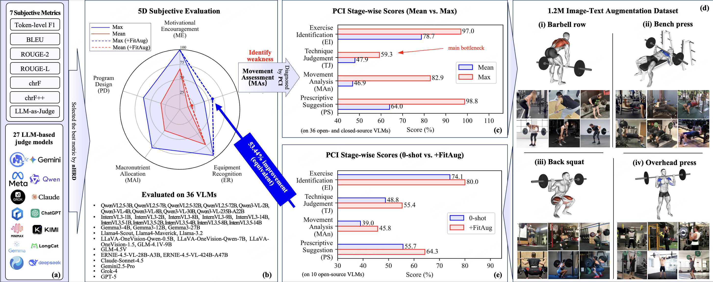
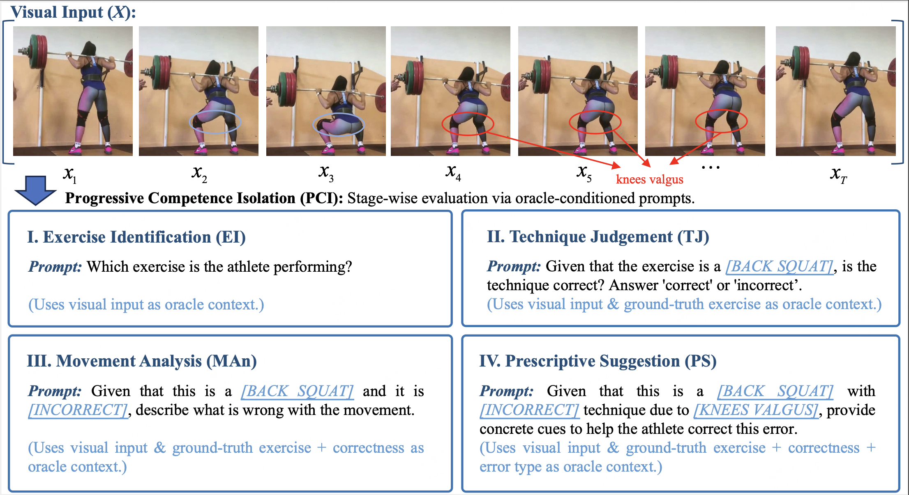

# FitAug-1.2M

FitAug-1.2M is a large-scale image-text augmentation dataset for vision-language-model (VLM) based fitness guidance.

This dataset is part of our broader effort to build a more reliable evaluation and improvement pipeline for AI fitness coaching. In our paper, we show that existing VLM-based fitness guidance systems are often evaluated too narrowly: they may generate fluent feedback, but their actual coaching competence is not measured in a sufficiently fine-grained and diagnostic way.

To address this, we introduce a 5-dimensional subjective evaluation framework for fitness guidance, covering not only movement assessment, but also motivational encouragement, program design, macronutrient allocation, and equipment recognition. For movement assessment, we further propose Progressive Competence Isolation (PCI), a stage-wise protocol that breaks the task into four sequential stages:

- Exercise Identification (EI)
- Technique Judgment (TJ)
- Movement Analysis (MAn)
- Prescriptive Suggestion (PS)

Using this framework, we build the FitGuid benchmark and evaluate a broad set of VLMs. Our analysis shows a clear and recurring bottleneck: many models can produce plausible explanations or suggestions, but remain much weaker at correctness-sensitive technique judgment. In practice, this means a model may sound helpful before it can reliably judge whether a movement is actually correct.

FitAug-1.2M is built to address this gap.

Rather than serving as a generic fitness dataset, FitAug-1.2M is a targeted augmentation dataset designed to improve stage-wise movement assessment under the PCI setting, especially the weakness exposed by benchmark diagnosis. It provides large-scale, structured image-text supervision for apparatus-centric resistance-training scenarios and supports more reliable, diagnostically grounded VLM fitness guidance.

In short:

- **FitGuid** tells us where current models fail.
- **PCI** tells us at which stage they fail.
- **FitAug-1.2M** provides targeted data to improve those failures.

## What this repository provides

This repository contains:

- an overview of the dataset and its design goals,
- a public subset of the data,
- benchmark-related documentation,
- dataset access information for the full release.

## Why this dataset exists

FitAug-1.2M was created to solve a practical problem:

> Current VLMs can often generate natural-sounding fitness feedback, but they still lack sufficiently reliable, fine-grained, and stage-aware supervision for movement assessment.

This dataset is intended to support:

- targeted augmentation for VLM-based fitness guidance,
- stage-wise training under the PCI protocol,
- stronger technique judgment,
- more trustworthy AI coaching systems.

## Scope

FitAug-1.2M focuses on four representative apparatus-centric exercises:

- Barbell row
- Bench press
- Back squat
- Overhead press

It covers diverse scenarios and fine-grained error types, and is designed for targeted model improvement rather than generic action recognition.